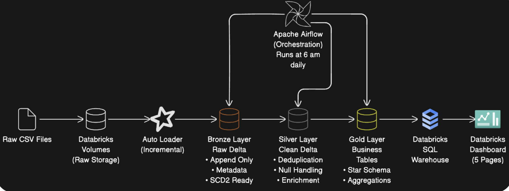
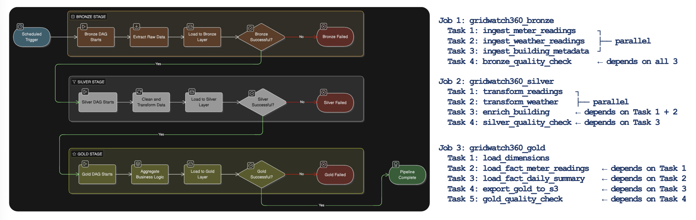

# ⚡ GridWatch 360

**Smart Building Energy Consumption Analytics Platform**

GridWatch 360 is an end-to-end data analytics platform designed to analyze energy consumption across 1,449 buildings and 16 global sites. It processes approximately 20 million raw meter readings, transforming them into actionable insights and real-time dashboards for facility managers to detect waste, anomalies, and inefficiencies.

## 🏗️ Architecture

GridWatch 360 is built on a modern data stack using the Medallion Architecture:
- **Landing Zone**: Raw CSV storage in Databricks Volumes.
- **Processing & Storage**: PySpark and Delta Lake (Bronze, Silver, Gold).
- **Orchestration**: Apache Airflow (Astro CLI) chaining 3 Databricks Workflow Jobs.
- **Data Modeling**: Star Schema in Databricks Catalogs.
- **Visualization**: Databricks Dashboards reading from Gold tables.

## 🥇 Medallion Architecture Deep Dive

### 🥉 Bronze Layer (Raw & Immutable)
- **Design Principles**: Raw data ingested as-is without business logic. Utilizes AutoLoader and WriteStream patterns.
- **Schema Evolution**: Automatically handles new columns (`addNewColumns`).
- **Audit Metadata**: Every row is tagged with `ingestion_timestamp`, `source_file_name`, `batch_id`, and `ingest_date` for lineage and debugging.
- **SCD Type 2**: Manages building metadata history (e.g., changes in primary use) using a `foreachBatch` pattern with `DeltaTable.merge()`.

### 🥈 Silver Layer (Transformed & Cleansed)
- **Design Principles**: Adds meaning and cleanses data. Partitioned by date for Spark and Athena query performance. Incremental processing via `readStream`.
- **Operations**: Uses MERGE (Upsert) for idempotency and enables Change Data Feed for downstream cost-efficiency.
- **Transformations**:
  - Type casting and time-window operations.
  - Spike anomaly detection using a 7-day rolling average.
  - Handling nulls (e.g., forward-filling weather data per site before falling back to medians).

### 🥇 Gold Layer (Business & Aggregated)
- **Star Schema**: Designed for BI and reporting. Detailed in the section below.
- **Quality Checks**: Over 20 strict tests covering Completeness, Uniqueness, Accuracy, Consistency, Referential integrity, and Range & Timeliness.

## 📊 Datasets Overview

The raw datasets ingested by the platform:

| File | Rows | Key Columns | Description |
| :--- | :--- | :--- | :--- |
| **meter_readings.csv** | ~20 million | `building_id`, `meter` (0-3), `timestamp`, `meter_reading` | Core time-series energy consumption data. |
| **weather_readings.csv** | ~140,000 | `site_id`, `timestamp`, 7 weather columns | Hourly weather recordings per site. |
| **building_metadata.csv** | 1449 buildings | `site_id`, `building_id`, `primary_use`, `square_feet`, `year_built`, `floor_count` | Building attributes and locations. |
| **building_use_changes.csv** | 10 rows | N/A | Simulated `primary_use` changes for SCD2 testing. |

## 🌟 Gold Layer Data Model (Star Schema)

The curated data exposed for BI and reporting consists of 7 Dimensions and 2 Fact tables.

### Dimension Tables

| Table | SCD Type | Rows | Key Design Decision |
| :--- | :--- | :--- | :--- |
| **DIM_DATE** | Static | 5,844 | Calendar spine 2010-2025 \| `date_key` = YYYYMMDD integer |
| **DIM_BUILDING** | Type 2 | 1,449+ | Tracks `primary_use` history to monitor building evolution. |
| **DIM_SITE** | Type 1 | 16 | `site_name` derived from `site_id`. |
| **DIM_METER_TYPE** | Static | 4 | Maps meter codes (0-3) to labels + units (e.g., Electricity). |
| **DIM_TIME_OF_DAY**| Static | 24 | Contains `period_label` + `is_business_hour` flag for 24-hr slices. |
| **DIM_BUILDING_USE** | Type 1 | ~16 | Distinct `primary_use` categories. |
| **DIM_WEATHER_CONDITION**| Snapshot | ~140K | SHA256 key on site+date+hour \| joined via `weather_key`. |

### Fact Tables

| Table | Type | Grain | Description |
| :--- | :--- | :--- | :--- |
| **FACT_METER_READINGS** | Transactional | 1 row per building × meter type × hour (~20M rows) | Stores the raw energy values, anomaly flags (`is_spike`, `is_zero_reading`), and denormalized weather details. |
| **FACT_DAILY_BUILDING_SUMMARY** | Aggregate | 1 row per building per day | Daily aggregated energy consumption, average temps, zero reading hours, spike counts, and data completeness %. |

## ⚙️ Orchestration Workflow

Airflow manages the data pipeline by orchestrating Databricks Jobs via event-driven triggers.
1. **Job 1 (Bronze)**: Ingests meter readings, weather readings, and building metadata in parallel, followed by bronze quality checks.
2. **Job 2 (Silver)**: Transforms readings and weather data in parallel, enriches building data, and performs silver quality checks.
3. **Job 3 (Gold)**: Loads dimensions and fact tables sequentially with dependencies, exports to S3, and runs final gold quality checks.

## 💻 Technology Stack
- **Cloud & Infrastructure**: AWS
- **Data Processing & Storage**: Databricks, PySpark, Delta Lake, Databricks Catalogs
- **Orchestration**: Apache Airflow (Astro CLI)
- **Visualization**: Databricks Lakeview Dashboards

## 📂 Repository Structure
- `/airflow`: Apache Airflow DAGs and orchestration logic.
- `/bronze`: Data ingestion scripts (AutoLoader, WriteStream, SCD2 logic).
- `/silver`: Transformation, cleansing, and anomaly detection scripts.
- `/gold`: Star schema construction, aggregation, and final data quality checks.
- `/setup`: Infrastructure and environment setup configurations.
- `/docs`: Project documentation and presentations.

## 🚀 Current Limitations & Future Scope
- **Known Issues**: Databricks CE limits on writing Delta logs directly to S3 (handled via Volumes); quality failures don't stop DAG execution; no automated data retention policy.
- **Future Improvements**: Implement fail-fast BranchPythonOperators in Airflow, enforce strict schemas at ingest, move fully to Infrastructure-as-Code via DatabricksCreateJobOperator, and build Slack/email alerting.
